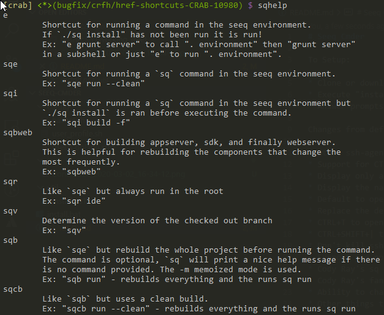

# Seeq Cmder

To Setup:

* Clone or download this repository as a zip
* Execute "install.bat" (no need for Administrator permissions)
* Answer prompts

Changes from default Cmder experienc:

* Start ssh-agent when the first Git Bash window is opened
* Support for CTRL clicking on files in the terminal to open them in explorer
* Display only a single instance of Cmder in the taskbar
* Display the name of the current directory as the tab title
* Default to opening Git Bash instead of CMD
* Replace the default Tasks with ones that make more sense (and have color coded icons)
* CTRL+T to open a new tab (using the current directory of the focused tab)
* CTRL+SHIFT+| to split console horizontally, CTRL+SHIFT+_ to split vertically
* Don't kill ssh-agent when closing Cmder
* Support for not loosing the current directory when `environment` is sourced
* Cody Ray's sq helpers built-in! (optional)
* Cody Ray's fancy prompt built-in! (optional)
* Ability to change the startup directory, create desktop shortcut, bind to context menu all from the install script
* Other things that I have probably forgoten... :)

## Optional Things

### Fancy Prompt


* Shows current directory in square brackets `[]`
* Shows repository root in brackets `<>` or `*` if already in that directory
* Shows branch in parenthesis `()` if in a branch
* Shows which directory `. environment` was ran on (if it has been ran)
* Shows the exit code in red if the command fails

This can be enabled or disabled by removing or adding `fancy_seeq_prompt` to `.bashrc`

For example:

```bash
. "${CMDER_ROOT}/config/bashrc.sh"
. "${HOME}/.config/bashrc.sh"
fancy_seeq_prompt
# enable_sq_helpers
```

### Sq Helpers



Running `sqhelp` shows a variety of helpers that can be used

This can be enabled or disabled by removing or adding `enable_sq_helpers` to `.bashrc`

```bash
. "${CMDER_ROOT}/config/bashrc.sh"
. "${HOME}/.config/bashrc.sh"
# fancy_seeq_prompt
enable_sq_helpers
```

## Troubleshooting

> I can't use bash outside of Cmder now!

That is probably because the install script manipulates `./bashrc`. To make it work with other bash things you might need to do something like this

```bash
CMDER_ROOT="${HOME}/bin/Cmder"
. "${CMDER_ROOT}/config/bashrc.sh"
. "${HOME}/.config/bashrc.sh"
fancy_seeq_prompt
enable_sq_helpers
```

So that there is no dependence on Cmder providing that environment variable
