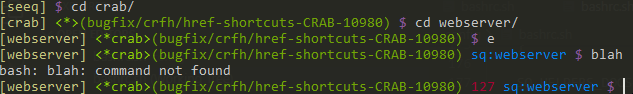

# Seeq Cmder

To Setup:

* Clone or download this repository as a zip
* Execute "install.bat" (no need for Administrator permissions)
* Answer prompts

Changes from default Cmder experienc:

* Start ssh-agent when the first Git Bash window is opened
* Support for CTRL clicking on files in the terminal to open them in explorer
* Display only a single instance of Cmder in the taskbar
* Display the name of the current directory as the tab title
* Default to opening Git Bash instead of CMD
* Replace the default Tasks with ones that make more sense (and have color coded icons)
* CTRL+T to open a new tab (using the current directory of the focused tab)
* CTRL+SHIFT+| to split console horizontally, CTRL+SHIFT+_ to split vertically
* Don't kill ssh-agent when closing Cmder
* Support for not loosing the current directory when `environment` is sourced
* Cody Ray's sq helpers built-in! (optional)
* Cody Ray's fancy prompt built-in! (optional)
* Ability to change the startup directory, create desktop shortcut, bind to context menu all from the install script
* Other things that I have probably forgoten... :)

## Upgrading

Periodically the scripts here will be updated. ConEmu will update itself, but occasionally new versions of git for windows are released that are worth updating for.

1. Rename your Cmder directory (likely `~/bin/Cmder`)
   * You might need to use task manager or process explorer to kill `ssh_agent.exe`
2. Pull the latest changes or download this repository as a zip
3. Re-execute "install.bat" and re-answer prompts
4. Copy over any configuration that you want to keep:
   * For example you might want to copy over`config/user-ConEmu.xml` from your backup since it contains all the settings and keymaps configured in the settings UI

## Optional Things

### Fancy Prompt



* Shows current directory in square brackets `[]`
* Shows repository root in brackets `<>` or `*` if already in that directory
* Shows branch in parenthesis `()` if in a branch
* Shows which directory `. environment` was ran on (if it has been ran)
* Shows the exit code in red if the command fails

This can be enabled or disabled by removing or adding `fancy_seeq_prompt` to `.bashrc`

For example:

```bash
. "${CMDER_ROOT}/config/bashrc.sh"
. "${HOME}/.config/bashrc.sh"
fancy_seeq_prompt
# enable_sq_helpers
```

### Sq Helpers


Running `sqhelp` shows a variety of helpers that can be used

This can be enabled or disabled by removing or adding `enable_sq_helpers` to `.bashrc`

```bash
. "${CMDER_ROOT}/config/bashrc.sh"
. "${HOME}/.config/bashrc.sh"
# fancy_seeq_prompt
enable_sq_helpers
```

## Troubleshooting

> I can't use bash outside of Cmder now!

That is probably because the install script manipulates `./bashrc`. To make it work with other bash things you might need to do something like this

```bash
CMDER_ROOT="${HOME}/bin/Cmder"
. "${CMDER_ROOT}/config/bashrc.sh"
. "${HOME}/.config/bashrc.sh"
fancy_seeq_prompt
enable_sq_helpers
```

So that there is no dependence on Cmder providing that environment variable

> I'd like to pin Cmder to the windows taskbar, but it ends up always starting in the Cmder directory!

For some reason different windows machines behave differently with this; I don't have a good explaination.

I have been able to workaround it by

1. Run Cmder
2. Right click on it in the taskbar
3. Select Pin
4. Close Cmder
5. Right click on the pinned icon in the taskbar
6. Right click again on Cmder in the dropup that is shown
7. Select Properties
8. Change the start-in directory to match the directory you'd like to have cmder start up in
